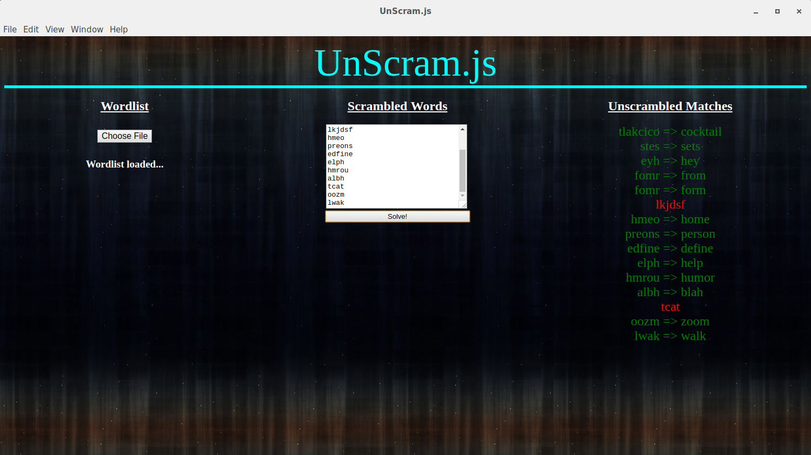

# UnScram.js

This application unscrambles scrambled words and prints the results to the user.

The user uploads a word list file (dictionary), and the program will iterate through each word in the dictionary word list, and each word in the scrambled word list.

Next, it will sort each word in alphabetical order. Once this is done, you can compare the two strings. If they match alphabetically, the scrambled word can now be identified as the unsorted dictionary word.

````
Unscrambled Word: cat
Scrambled Word  : tca

Sorting alphabetically *
Unscrambled Sorted: act
Scrambled Sorted  : act

The two words above match alphabetically, so it is implied that
tca => cat
````


